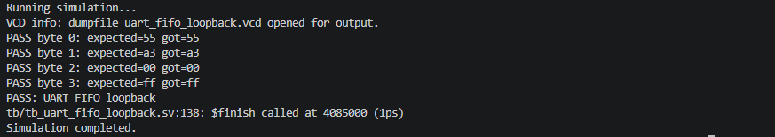

# UART FIFO Loopback

## Goal

Build a small UART communication subsystem:

`UART RX -> Synchronous FIFO -> UART TX`

The design receives serial data through the UART RX interface, stores the received bytes in a synchronous FIFO, and transmits them back through UART TX.

## Features

- UART receiver implemented using an FSM
- UART transmitter implemented using an FSM
- Synchronous FIFO buffering
- Serial protocol timing
- Back-to-back byte handling

## Files

- `rtl/sync_fifo.sv`
- `rtl/uart_rx.sv`
- `rtl/uart_tx.sv`
- `rtl/uart_fifo_loopback.sv`
- `tb/tb_uart_fifo_loopback.sv`
- `run_iverilog.ps1`

```markdown
## Run

Run the simulation from the project directory:

```powershell
powershell -ExecutionPolicy Bypass -File .\run_iverilog.ps1
```

Expected result:

```text
PASS byte 0: expected=55 got=55
PASS byte 1: expected=a3 got=a3
PASS byte 2: expected=00 got=00
PASS byte 3: expected=ff got=ff
PASS: UART FIFO loopback
```

## Next Improvements

- Add parity.
- Add framing error detection.
- Add AXI-Stream style interface around the UART.
- Synthesize in Vivado and add a timing/utilization report.

## Simulation Result

The self-checking testbench sends four UART bytes through the RX interface, buffers them in the synchronous FIFO, and verifies the transmitted loopback data.


